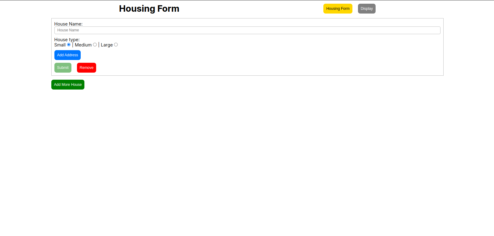
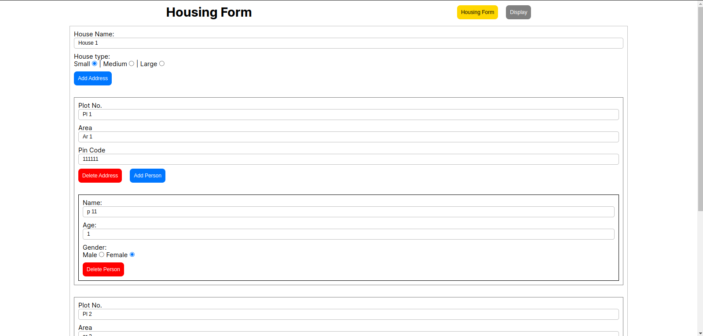
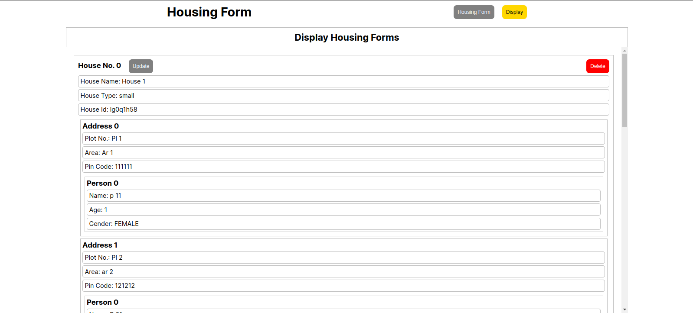

# Angular Task: Angular Dynamic Forms

### Task: 
- Create a reactive form for filling housing details.
- Users can add multiple details at the same time.
- Once the user save details save that data into local

### Preview:

